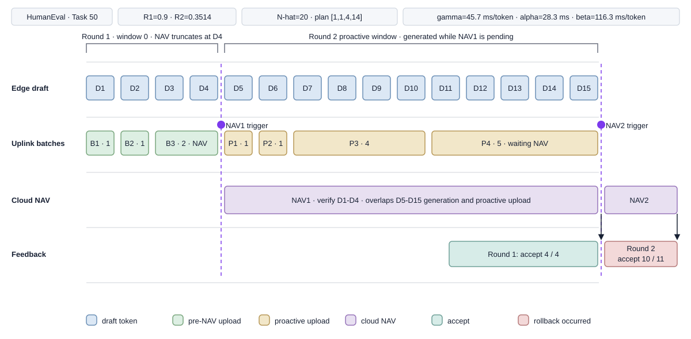

# PipeSD HumanEval Task 50 流水线图分析



## 1. 数据来源与图的范围

本图使用以下正式测评结果：

[`edge/exp/exp__wjl__final/humaneval/pipesd/st=0.3514_mt=0.9_merge=dp_tag=table1_s1_paper_bw=2.5MB_run=210c748dcab841ffa15d82a4ced56f9e.json`](../edge/exp/exp__wjl__final/humaneval/pipesd/st=0.3514_mt=0.9_merge=dp_tag=table1_s1_paper_bw=2.5MB_run=210c748dcab841ffa15d82a4ced56f9e.json)

当前 `edge/exp/exp__wjl/` 只有目录结构，没有可读取的结果 JSON，因此采用 `exp__wjl__final` 中对应的 HumanEval PipeSD 正式结果。

图中选取：

- 数据集：`manifest.dataset = "humaneval"`
- 算法：`manifest.algorithm = "pipesd"`
- 样本：`samples[0]`
- Task ID：`samples[0].task_id = 50`
- Sample index：`samples[0].sample_index = 50`
- 展示范围：Task 50 最开始的两次 NAV

图的横轴表示事件顺序，不是严格的 wall-clock 时间比例。结果文件记录了批次顺序、批次大小、NAV 标志和请求耗时，但没有保存每个 Token 以及每次 NAV 的绝对开始/结束时间戳。

## 2. 顶部参数

### 2.1 HumanEval · Task 50

对应：

```text
manifest.dataset = "humaneval"
manifest.algorithm = "pipesd"
samples[0].task_id = 50
samples[0].sample_index = 50
samples[0].output_length = 128
samples[0].total_time = 53.53317046165466
```

完整 Task 50 生成了 128 个输出 Token。图只展示开头两轮，不代表完整任务的全部 Token。

### 2.2 R1 和 R2

对应：

```text
samples[0].thresh_multi = 0.9
samples[0].thresh_single = 0.3514
```

也可以从以下位置读取：

```text
manifest.arguments.verify_thresh_multi
manifest.arguments.verify_thresh_single
```

含义：

- `R1=0.9`：累计序列置信度阈值。
- `R2=0.3514`：单 Token 置信度阈值。
- 累计序列置信度低于 R1，或者当前 Token 置信度低于 R2，都会触发 NAV。

当前结果没有保存触发瞬间的两种置信度，因此只能确定 NAV 在哪个 Batch 触发，不能确定是 R1 还是 R2 导致触发。

### 2.3 调度窗口 N-hat

前七条 `batch_trace` 均包含：

```text
scheduling_window = 20
```

N-hat 是 DP 调度窗口，不表示本轮一定会生成 20 个 Token。双阈值提前触发 NAV 时，当前窗口会被中断，未达到计划大小的 Batch 会立即 Flush。

本图中：

- Round 1 在生成 4 个 Token 后触发 NAV。
- Round 2 在生成 11 个 Token 后触发 waiting NAV。
- 两轮都没有走满 20 Token。

### 2.4 活动 DP 计划 `[1,1,4,14]`

活动计划由前七条 trace 的 `planned_batch_size` 重建：

```text
1 + 1 + 4 + 14 = 20
```

表示原计划：

| Batch | 计划大小 |
|---|---:|
| 1 | 1 |
| 2 | 1 |
| 3 | 4 |
| 4 | 14 |

实际执行：

```text
Round 1: [1,1,2]
Round 2: [1,1,4,5]
```

Round 1 的第三批计划发送 4 个 Token，但生成 2 个后 NAV 被触发；Round 2 的第四批计划发送 14 个 Token，但生成 5 个后 waiting NAV 被触发。

#### `planned_batches` 字段不一致说明

同一批 trace 中还可能看到：

```text
planned_batches = [1,2,6,11]
```

它与 `planned_batch_size` 重建出的活动计划不一致。原因是：

- `planned_batch_size` 来自本轮已经选定的局部 `merge_plan_batches`。
- `planned_batches` 是写 trace 时再次调用 `dp_scheduler.plan()` 得到的当前快照。
- 在线通信和生成参数更新可能已经改变 scheduler 的当前计划。

因此绘制某一轮真实执行过程时，应优先采用：

```text
planned_batch_size
actual_batch_size
plan_index
```

而不是只使用 `planned_batches`。这是 telemetry 记录时序语义的不一致，并不必然代表 DP 执行错误。

### 2.5 alpha、beta、gamma

图中的参数来自：

```text
samples[0].environment_measurements.dp_scheduler
```

原始值：

```text
alpha = 0.028303852022653286 s
beta  = 0.11630306454648179 s/token
gamma = 0.04565524309873581 s/token
```

换算后：

```text
alpha = 28.3 ms
beta  = 116.3 ms/token
gamma = 45.7 ms/token
```

含义：

- `gamma`：Edge 生成一个 Token 的平均耗时。
- `alpha`：一次 Batch 传输的固定启动开销。
- `beta`：每增加一个 Token 带来的传输时间。

DP 使用近似通信模型：

```text
Tcommunication(n) = alpha + beta * n
```

需要注意，结果中保存的是样本结束时的 scheduler 快照，不一定是第一轮开始时的历史参数。若要精确复原每轮 DP 决策，应将当时的 alpha、beta、gamma 一起写入每条 `batch_trace`。

## 3. 四条泳道

| 泳道 | 代表内容 | 主要字段 |
|---|---|---|
| Edge draft | 边缘小模型逐 Token 自回归生成 | `batch_trace`、`verify_stats.num_spec_tokens_generated` |
| Uplink batches | Token 按 DP 计划组成 Batch 并上传 | `phase`、`batch_id`、`actual_batch_size` |
| Cloud NAV | 云端 Target Model 执行验证 | sender `recent_requests` 中的 `measurement_kind="nav"` |
| Feedback | 接受长度、拒绝长度和回滚 | `verify_his`、`diagnostics` |

## 4. Edge draft：D1 到 D15

图中的 D1-D15 不是词表中的真实 Token ID，而是根据生成顺序重新编号的示意标识。

`batch_trace` 没有保存 Token ID，只保存：

```text
token_start_index
actual_batch_size
```

因此图可以准确重建 Token 的数量和所属 Batch，但不能显示它们在词表中的真实 ID。

### 4.1 Round 1：D1-D4

前三条 trace：

| Trace | phase | token_start_index | actual_batch_size | 图中 Token |
|---:|---|---:|---:|---|
| 0 | `draft` | 0 | 1 | D1 |
| 1 | `draft` | 1 | 1 | D2 |
| 2 | `draft` | 2 | 2 | D3-D4 |

本轮共生成：

```text
1 + 1 + 2 = 4 Tokens
```

与以下结果一致：

```text
verify_his[0] = [4,4]
diagnostics.draft_lengths[0] = 4
```

### 4.2 Round 2：D5-D15

后四条 trace 为 `waiting_nav`：

| Trace | phase | token_start_index | actual_batch_size | 图中 Token |
|---:|---|---:|---:|---|
| 3 | `waiting_nav` | 0 | 1 | D5 |
| 4 | `waiting_nav` | 1 | 1 | D6 |
| 5 | `waiting_nav` | 2 | 4 | D7-D10 |
| 6 | `waiting_nav` | 6 | 5 | D11-D15 |

本轮共生成：

```text
1 + 1 + 4 + 5 = 11 Tokens
```

对应：

```text
verify_his[1] = [11,10]
diagnostics.draft_lengths[1] = 11
```

图中为了表现连续事件，将本轮标为 D5-D15；结果文件中的 `token_start_index` 会在新的 speculative round 内从 0 重新计数。

## 5. Window 与 speculative round

### 5.1 Round 1 · window 0

前三条 trace：

```text
phase = "draft"
speculative_round_id = 0
window_id = 0
scheduling_window = 20
```

表示正常的 NAV 前流水线发送。窗口原计划最多调度 20 个 Token，但 D4 后提前触发 NAV。

### 5.2 Round 2 proactive window

后四条 trace：

```text
phase = "waiting_nav"
speculative_round_id = 1
window_id = 0
scheduling_window = 20
```

这表示 NAV1 尚未返回时，Edge 已经为下一轮生成并上传 Token。这是 PipeSD 隐藏 Cloud NAV 等待时间的核心机制。

判断上传类型时，应使用：

```text
phase = "draft"        -> NAV 前正常上传
phase = "waiting_nav"  -> 等待 NAV 时 proactive 上传
```

## 6. Uplink batches

### 6.1 B1 和 B2

B1：

```text
batch_id = 0
planned_batch_size = 1
actual_batch_size = 1
token_start_index = 0
should_verify = false
```

B2：

```text
batch_id = 1
planned_batch_size = 1
actual_batch_size = 1
token_start_index = 1
should_verify = false
```

D1、D2 分别生成后上传到 Cloud Buffer，但不执行 NAV。

### 6.2 B3：计划 4，实际 2

```text
batch_id = 2
planned_batch_size = 4
actual_batch_size = 2
token_start_index = 2
should_verify = true
flush_reason = "nav"
```

DP 原计划第三批收集 4 个 Token，但 D3、D4 生成后双阈值已经触发 NAV，因此当前两 Token 被立即 Flush。

最后一次 NAV 请求只携带 D3、D4，但 Cloud 已通过 B1、B2 缓存 D1、D2，所以 NAV1 实际验证 4 个 Token。

### 6.3 P1-P4：proactive Batch

| Batch | planned | actual | should_verify |
|---|---:|---:|---|
| P1 | 1 | 1 | false |
| P2 | 1 | 1 | false |
| P3 | 4 | 4 | false |
| P4 | 14 | 5 | true |

P4：

```text
phase = "waiting_nav"
planned_batch_size = 14
actual_batch_size = 5
should_verify = true
flush_reason = "waiting_nav"
```

说明等待 NAV1 时生成的下一轮序列，在第四批累计到 5 个 Token 时又满足了 NAV 条件，因此没有等待计划中的 14 个 Token，而是立即 Flush 并请求 NAV2。

## 7. NAV 触发虚线

NAV1：

```text
batch_trace[2].should_verify = true
batch_trace[2].flush_reason = "nav"
```

NAV2：

```text
batch_trace[6].should_verify = true
batch_trace[6].flush_reason = "waiting_nav"
```

图能确定 NAV 的触发位置，但结果没有保存：

```text
single_token_confidence
sequence_confidence
trigger_reason
```

因此无法从现有 JSON 判断具体是哪一个阈值触发。

## 8. Cloud NAV 与网络测量

### 8.1 NAV1

第一条主通道 NAV 请求位于：

```text
samples[0]
  .environment_measurements
  .primary_sender
  .recent_requests
```

其中第一条 `measurement_kind="nav"`：

```text
token_count             = 2
upload_seconds          = 0.2573116
link_queue_wait_seconds = 0.1354013
http_seconds            = 1.6032344
download_seconds        = 0.00000436
total_elapsed_seconds   = 1.9961020
```

`token_count=2` 仅表示最后一次 NAV 请求携带的 D3、D4；Cloud 累计 Buffer 中已经有 D1、D2，因此总验证长度为 4。

图中的 NAV1 长条强调它与 D5-D15 的生成及 proactive 上传发生重叠，不按 1.996 秒严格缩放。

### 8.2 NAV2

第一条 proactive NAV 请求位于：

```text
samples[0]
  .environment_measurements
  .proactive_sender
  .recent_requests
```

对应：

```text
tag                   = "wait_50_112"
token_count           = 5
measurement_kind      = "nav"
upload_seconds        = 0.6057016
http_seconds          = 1.9556365
total_elapsed_seconds = 2.5618662
```

最后一次请求携带 P4 的 5 个 Token；之前的 P1、P2、P3 已缓存 6 个，所以 NAV2 总计验证 11 个 Token。

`http_seconds` 可能同时包含 FastAPI 处理、Cloud 排队、模型上下文操作、NAV 和响应序列化，不应直接等价为纯 GPU NAV 计算时间。

## 9. Feedback 与回滚

`verify_his` 每一项格式为：

```text
[本轮 speculative token 数, 被接受 token 数]
```

写入逻辑位于 `edge/src/engine.py` 的 `verify_his.append(...)`。

### 9.1 Round 1：accept 4/4

```text
verify_his[0] = [4,4]
diagnostics.draft_lengths[0] = 4
diagnostics.accepted_lengths[0] = 4
diagnostics.rejected_lengths[0] = 0
```

四个 draft token 全部通过验证。

### 9.2 Round 2：accept 10/11

```text
verify_his[1] = [11,10]
diagnostics.draft_lengths[1] = 11
diagnostics.accepted_lengths[1] = 10
diagnostics.rejected_lengths[1] = 1
```

前十个 draft token 被接受，第十一个被拒绝，Cloud 返回纠正 Token，Edge 回滚未接受的 speculative 状态，因此图中使用红色 rollback 标记。

## 10. 图底部的样本统计

| 图中指标 | 结果字段 | 数值 |
|---|---|---:|
| Output tokens | `samples[0].output_length` | 128 |
| NAV 数量 | `verify_stats.num_verifications` | 23 |
| 平均 Draft length | `diagnostics.mean_verify_spec_len` | 4.9130 |
| Rollback events | `diagnostics.rollback_events` | 7 |
| Rollback rate | `diagnostics.rollback_rate` | 30.43% |
| Proactive reused | `reused_proactive_tokens` | 52 |
| Proactive discarded | `discarded_proactive_tokens` | 16 |

`reused_proactive_tokens=52` 和 `discarded_proactive_tokens=16` 是完整 Task 50 的累计值，不是图中前两轮单独的计数。

## 11. 颜色与字段对应

| 图形 | 含义 | 判断方式 |
|---|---|---|
| 蓝色 D Token | Edge draft generation | 根据 `actual_batch_size` 重建 |
| 绿色 B Batch | NAV 前上传 | `phase="draft"` |
| 黄色 P Batch | 等待 NAV 时 proactive 上传 | `phase="waiting_nav"` |
| 紫色 NAV | Cloud verification | sender request 的 `measurement_kind="nav"` |
| 红色反馈 | 本轮存在 rejected Token | `accepted_lengths[i] < draft_lengths[i]` |

## 12. 原始数据与重建内容

### 结果文件直接记录

- Dataset、algorithm、task ID。
- R1、R2。
- Scheduling window。
- Batch ID、plan index。
- Planned 和 actual batch size。
- Token start index。
- Phase、should_verify、flush_reason。
- Verification length 和 accepted length。
- 请求的上传、排队、HTTP、下载耗时。
- alpha、beta、gamma 最终估计。
- proactive reused/discarded 总数。

### 图中重建

- D1-D15 的连续编号。
- 将第二轮 Token 接在第一轮后显示。
- NAV 与 proactive generation 的横向重叠关系。
- 活动计划 `[1,1,4,14]`。
- NAV 色块的视觉宽度。

### 当前无法从结果确定

- 每个 Token 的真实 Token ID。
- Token 生成的绝对时间。
- Batch 的提交、开始和完成绝对时间。
- NAV 的绝对开始、结束和纯 GPU 时间。
- NAV 是 R1 还是 R2 触发。
- 每轮 proactive buffer 的复用/废弃状态。
- 每轮 DP 使用的 alpha、beta、gamma 历史值。

## 13. 精确时间轴所需的新增字段

如果要生成严格按毫秒比例绘制的 Figure 2，建议每条 trace 增加：

```json
{
  "event_time": 12.345,
  "generation_started_at": 12.301,
  "generation_finished_at": 12.345,
  "send_submitted_at": 12.346,
  "send_started_at": 12.410,
  "send_finished_at": 12.667,
  "nav_started_at": 12.670,
  "nav_finished_at": 14.231,
  "single_token_confidence": 0.42,
  "sequence_confidence": 0.83,
  "trigger_reason": "sequence_threshold",
  "scheduler_alpha": 0.0283,
  "scheduler_beta": 0.1163,
  "scheduler_gamma": 0.0457,
  "active_batch_plan": [1, 1, 4, 14],
  "proactive_reused": true
}
```

补充后可以准确绘制：

- Edge 每个 Token 的生成区间。
- 生成和传输的真实重叠比例。
- Batch 的链路排队时间。
- Cloud NAV 的真实执行区间。
- NAV 期间 Edge 生成了多少 Token。
- 触发 NAV 的具体阈值。
- proactive Token 最终被复用还是废弃。

