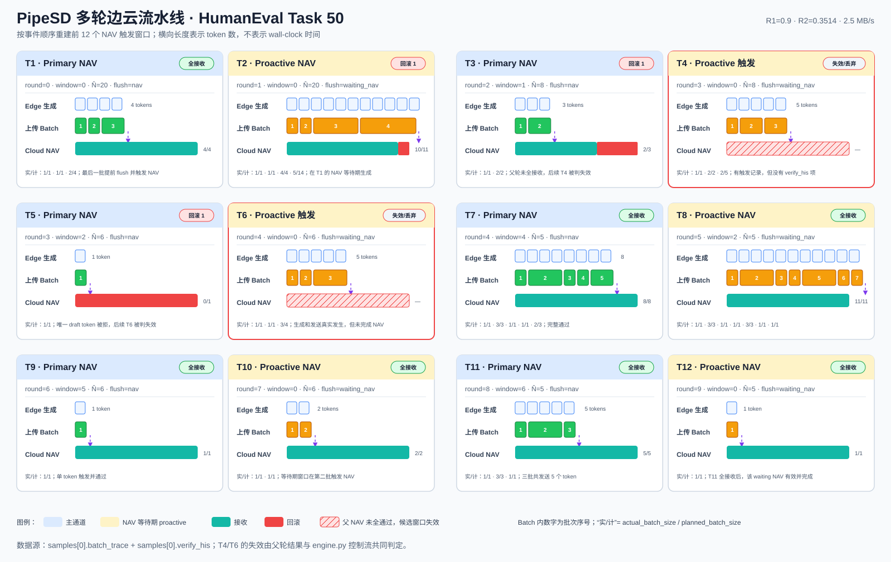

# PipeSD HumanEval Task 50 多轮流水线图说明



## 1. 图画了什么

这张图把同一个 Task 50 开头的 **12 个 NAV 触发窗口**画成连续小面板。它们不是 12 个都完成的 NAV：

- T1、T2、T3、T5、T7～T12：共 10 次真正完成的 NAV，对应 `verify_his` 的前 10 项。
- T4、T6：Edge 已在 NAV 等待期生成 token、分 batch 上传并触发 `waiting_nav`，但父 NAV 没有全接收，因此这两个候选轮次失效，不会追加到 `verify_his`。

图按事件顺序排列，不按实际耗时比例排列。结果文件没有逐 token 的绝对时间戳，因此不能从这些字段恢复精确的毫秒级甘特图。

## 2. 原始结果文件

数据来自：

[`edge/exp/exp__wjl__final/humaneval/pipesd/st=0.3514_mt=0.9_merge=dp_tag=table1_s1_paper_bw=2.5MB_run=210c748dcab841ffa15d82a4ced56f9e.json`](../edge/exp/exp__wjl__final/humaneval/pipesd/st=0.3514_mt=0.9_merge=dp_tag=table1_s1_paper_bw=2.5MB_run=210c748dcab841ffa15d82a4ced56f9e.json)

选择的是 `samples[0]`：

```text
task_id = 50
output_length = 128
total_time = 53.53317046165466 s
thresh_multi = 0.9
thresh_single = 0.3514
```

## 3. 12 个窗口与原始字段的逐项对应

`batch_trace` 中从上一次 `should_verify=true` 之后，到下一次 `should_verify=true` 为止的一组记录，构成图中的一个触发窗口。表内 `Batch 实/计` 对应每条记录的 `actual_batch_size/planned_batch_size`。

| 图中窗口 | `phase` | `speculative_round_id` | `window_id` | `scheduling_window` | Batch 实/计 | 生成/发送总数 | NAV 结果 |
|---|---:|---:|---:|---:|---|---:|---|
| T1 | `draft` | 0 | 0 | 20 | 1/1, 1/1, 2/4 | 4 | `verify_his[0]=[4,4]` |
| T2 | `waiting_nav` | 1 | 0 | 20 | 1/1, 1/1, 4/4, 5/14 | 11 | `verify_his[1]=[11,10]` |
| T3 | `draft` | 2 | 1 | 8 | 1/1, 2/2 | 3 | `verify_his[2]=[3,2]` |
| T4 | `waiting_nav` | 3 | 0 | 8 | 1/1, 2/2, 2/5 | 5 | 父 T3 未全接收，失效；无 `verify_his` 项 |
| T5 | `draft` | 3 | 2 | 6 | 1/1 | 1 | `verify_his[3]=[1,0]` |
| T6 | `waiting_nav` | 4 | 0 | 6 | 1/1, 1/1, 3/4 | 5 | 父 T5 未全接收，失效；无 `verify_his` 项 |
| T7 | `draft` | 4 | 4 | 5 | 1/1, 3/3, 1/1, 1/1, 2/3 | 8 | `verify_his[4]=[8,8]` |
| T8 | `waiting_nav` | 5 | 2 | 5 | 1/1, 3/3, 1/1, 1/1, 3/3, 1/1, 1/1 | 11 | `verify_his[5]=[11,11]` |
| T9 | `draft` | 6 | 5 | 6 | 1/1 | 1 | `verify_his[6]=[1,1]` |
| T10 | `waiting_nav` | 7 | 0 | 6 | 1/1, 1/1 | 2 | `verify_his[7]=[2,2]` |
| T11 | `draft` | 8 | 6 | 5 | 1/1, 3/3, 1/1 | 5 | `verify_his[8]=[5,5]` |
| T12 | `waiting_nav` | 9 | 0 | 5 | 1/1 | 1 | `verify_his[9]=[1,1]` |

## 4. 每个面板的三条泳道

### Edge 生成

蓝色小方块表示本窗口实际生成的 draft token。数量等于这一组 `batch_trace` 的：

```text
sum(actual_batch_size)
```

例如 T2 的四批实际大小为 `1+1+4+5=11`，所以画 11 个 token。

### 上传 Batch

绿色表示主通道 `phase="draft"`，橙色表示父 NAV 运行时的 proactive 通道 `phase="waiting_nav"`。矩形宽度按 `actual_batch_size` 绘制，矩形里的 1、2、3……是 `batch_id+1`。

面板底部的“实/计”用于显示计划被提前截断的情况。例如 T1 最后一批 `2/4` 表示 DP 原计划发送 4 个，但双阈值在生成 2 个后触发 NAV，于是立即 flush 这 2 个。

触发批次具有：

```text
should_verify = true
flush_reason = "nav"          # 主通道
flush_reason = "waiting_nav"  # NAV 等待期通道
```

### Cloud NAV

青色表示云端接受的 draft token，红色表示未接受、需要回滚的 draft token。右侧 `a/d` 对应 `verify_his` 的 `[draft_length, accepted_length]`，图中按更直观的“accepted/draft”显示。

例如：

```text
verify_his[1] = [11, 10]
```

表示送去验证 11 个 draft token，云端接受前 10 个，第 11 个被回滚，因此图中写为 `10/11`。

## 5. 为什么 T4 和 T6 有发送，却没有 NAV 结果

这是 PipeSD 流水线最容易误读的地方。

T4 在 T3 的云端 NAV 尚未返回时提前运行。它确实生成 5 个 token，也确实按 `1,2,2` 上传，并且最后一批出现 `should_verify=true`。但是 T3 的结果是 `2/3`，父轮没有全接收。

`edge/src/engine.py` 的处理逻辑是：只有父 NAV `last_verify_all_passed` 时，waiting NAV 才能继续读取并提交自己的验证结果；父 NAV 未全通过时，会取消/排空等待期 future，并丢弃该轮候选 token。因此 T4 不会追加到 `verify_his`。

T6 同理：其父轮 T5 的结果为 `0/1`，所以 T6 也失效。

这也解释了为什么不能把每个 `batch_trace.should_verify=true` 简单地与 `verify_his` 按索引一一配对：`batch_trace` 记录“触发过”，`verify_his` 只记录“真正完成并被 Edge 处理的验证”。

## 6. 从多轮图能看出的调度变化

前 12 个窗口中，`scheduling_window` 从 20 下降到 8、6、5，并在局部回到 6。这说明 DP 调度会根据已观测到的生成、传输和验证行为在线更新窗口，而不是固定使用一个 draft 长度。

同时，实际批大小经常小于计划批大小，例如：

- T1：`2/4`
- T2：`5/14`
- T4：`2/5`
- T6：`3/4`
- T7：`2/3`

这些都是双阈值提前触发后立即 flush 的直接痕迹。也就是说，DP 决定“理想情况下怎么分 batch”，双阈值决定“实际运行时何时提前停止并触发 NAV”。

## 7. 与原两轮详图的关系

原图 [`pipesd-humaneval-trace.svg`](./pipesd-humaneval-trace.svg) 放大展示 T1 和 T2，适合解释 token、batch、NAV 与反馈的细节；本图扩大到 T1～T12，适合观察连续多轮中的窗口变化、回滚和 proactive 失效。

