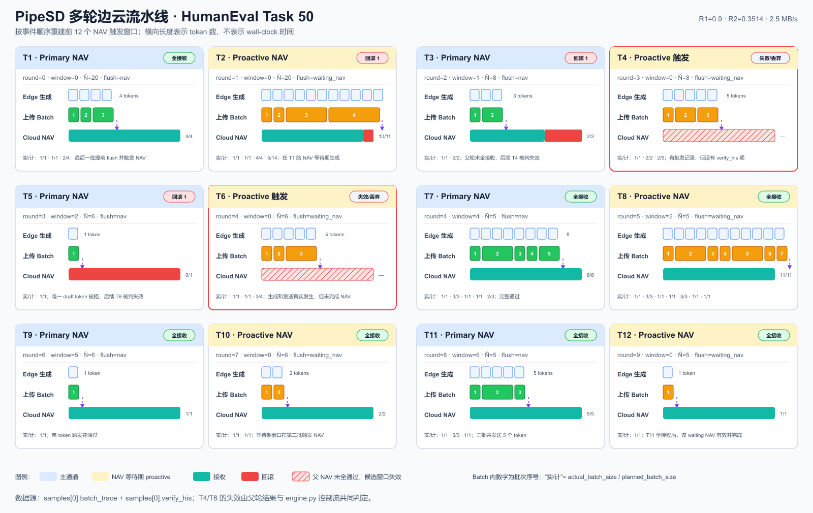

# PipeSD 复现进度汇报：PPT 逐页内容与讲稿

> 适用场景：基于当前仓库、论文和现有测评结果制作一次约 18～22 分钟的阶段汇报。  
> 主体共 18 页，附录 4 页。每页都包含“页面内容”“建议图示”和“讲稿”。  
> 论文：[PipeSD: An Efficient Cloud-Edge Collaborative Pipeline Inference Framework with Speculative Decoding](https://arxiv.org/abs/2605.13319)

## 使用前必须统一的表述

- 本次是**协议与机制复现**，不是论文全部结果的完整复刻。当前已重点复现论文 Scenario 1 的四种算法协议，并增加了纯边、纯云、边云串行、PipeSD 四种部署模式的扩展对比。
- 当前实验绝对时延明显高于论文，不能说“复现了论文数值”；可以说“复现了 PipeSD 的核心机制，并在当前软硬件条件下观察到相对收益”。
- Git 中查询到的作者名是 `Nuyoahwjl`，不是题目中拼写的 `Nuyoshwjl`。下文按仓库实际作者名统计，共 8 个相关提交。
- “纯云”结果只计算云端模型解码，不含客户端传输和 prefill，是理想下界；“纯边”使用 draft 小模型，输出质量与 target 大模型不等价。因此四模式结果主要用于拆解系统开销，不能简单解释为四种同质量服务的公平竞赛。
- 当前能耗是**云端 GPU 能耗**，纯边没有 RAPL/外接功率计数据，不能据此给出端到端系统总能耗结论。

---

## 第 1 页：封面

### 页面内容

**标题：** PipeSD 云边协同推测解码复现进度  
**副标题：** 从论文机制、代码实现到四算法与四部署模式测评  
**页脚：** 汇报人 / 日期 / 项目仓库

### 建议图示

使用论文工作流图作为淡化背景，或者放置本仓库的多轮流水线图缩略图：

### 讲稿

今天汇报的是 PipeSD 的阶段性复现。我会先解释它为什么需要云边流水线，以及 DP 批调度、双阈值 NAV 和 BO 自动调参分别解决什么问题；然后结合当前代码说明我已经对齐了哪些机制；最后展示两组实验：第一组比较 Vanilla、HSL、EdgeLLM 和 PipeSD，第二组拆解纯边、纯云、边云串行和 PipeSD，并说明目前距离论文完整复现还差哪些工作。

---

## 第 2 页：汇报结论先行

### 页面内容

**已完成**

- PipeSD 核心闭环：边缘 draft、边生成边上传、云端 NAV、返回 accepted tokens、下一轮衔接。
- DP token-batch 调度、双阈值触发、16 次 BO、在线环境估计和共享 FIFO 软件链路。
- Scenario 1 风格的四算法 1000-token 测评；两任务均观察到 PipeSD 相对收益。
- 纯边 / 纯云 / 边云串行 / PipeSD 四模式拆解，以及可追踪的多轮流水线图。

**关键结果**

- HumanEval：PipeSD 相对 Vanilla 加速 **1.320×**，云 GPU 能耗降低 **22.2%**。
- GSM8K：PipeSD 相对 Vanilla 加速 **1.143×**，相对最佳基线 HSL 加速 **1.090×**，云 GPU 能耗降低 **11.7%**。

**尚未完成**

- 论文 Scenario 2～4 的完整正式结果、带宽扫描、消融、BO 对照、正确率和多次重复置信区间。
- 论文原硬件、真实公网链路与论文绝对数值的复刻。

### 建议图示

三栏：已完成 / 关键结果 / 未完成。关键数字用大号字体。

### 讲稿

先给出结论：核心系统机制已经跑通，而且 PipeSD 在两个任务上都优于串行 Vanilla。HumanEval 的收益更明显，达到 1.32 倍；GSM8K 的收益较小，为 1.143 倍。这里的完成主要指协议、并发和测评链路已经形成，不代表论文所有表格都复刻出来。当前最重要的缺口是测试床不一致、正式实验覆盖不足，以及只有单次 1000-token 结果，没有置信区间和任务正确率。

---

## 第 3 页：问题背景——为什么传统云边推测解码还不够快

### 页面内容

传统云边推测解码一轮通常是：

1. 边缘小模型串行生成一段 draft tokens；
2. 生成结束后才整体上传；
3. 云端大模型执行 Non-Autoregressive Verification，简称 NAV；
4. 边缘等待验证结果，再开始下一轮。

两个主要瓶颈：

- **生成与通信串行**：上传阶段边缘算力空闲，生成阶段链路空闲。
- **固定长度或单阈值触发僵化**：过早 NAV 会产生高固定通信开销；过晚 NAV 会累积低质量 token，导致回滚。

### 建议图示

画两条时间轴：传统流程的 Generate → Upload → NAV → Wait，与 PipeSD 的重叠时间块对比。

### 讲稿

PipeSD 关注的不是简单地把小模型放边缘、大模型放云端，而是如何让这两个异构阶段持续工作。传统流程里，draft 生成、网络传输和云端验证基本串行，导致设备和网络交替空闲。触发 NAV 也存在两难：发得太频繁，启动开销很大；积攒太久，一旦后面的 token 置信度下降，就会回滚更多无效计算。论文的两个核心机制正好对应这两个问题：DP 批调度负责重叠生成与传输，双阈值加 BO 负责决定何时验证。

---

## 第 4 页：推测解码与 NAV 到底做了什么

### 页面内容

设边缘 draft 模型生成候选序列：

\[
D=(d_1,d_2,\ldots,d_n)
\]

云端 target 模型一次前向并行检查这段候选：

- 从前向后接受与 target 采样规则一致的最长前缀；
- 在 accepted prefix 后，target 还会给出一个额外 token；
- 若发生拒绝，拒绝点之后的 draft token 全部失效；
- 下一轮上下文必须以云端确认后的序列为准。

**关键边界：** target 额外 token 与边缘提前生成的下一轮首 token 相同，才可复用该提前结果；否则必须丢弃并重新开始。

### 建议图示

示例：draft 为 A B C D，云端接受 A B，拒绝 C，并返回 X；结果上下文为 A B X，C D 及其派生 token 作废。

### 讲稿

NAV 的核心是用 target 大模型一次性验证一批 draft token，而不是逐 token 调用大模型。云端总会在接受前缀后提供一个 target token，用它保证序列能继续前进。需要强调的是，PipeSD 为了隐藏等待时间，会在 NAV 返回前继续生成甚至提前上传下一轮候选。但这并不代表这些 token 已经确认。如果云端只接受部分 token，或者即使全部接受但额外 token 与边缘预测的衔接 token 不一致，那么提前生成的数据都不能直接进入正式上下文，必须取消或丢弃。当前实现专门维护父轮次和父 token 元数据来保证这一点。

---

## 第 5 页：PipeSD 总体架构

### 页面内容

**Edge**

- Draft Model：自回归产生候选 token 与置信度。
- Transmission Controller：DP 批调度器 + 双阈值 NAV 触发器。
- Environment Monitor：估计生成时间 \(\gamma\)、通信启动开销 \(\alpha\) 和单位 token 通信时间 \(\beta\)。
- Parameter Updater：BO 更新双阈值，DP 根据环境参数重算批边界。
- Communication Interface：上传 draft batch，接收 NAV 结果。

**Cloud**

- Communication API：接收带轮次元数据的候选批次。
- Target Model：执行 NAV，返回 accepted prefix 和额外 target token。

### 建议图示

画两个大框 Edge / Cloud，中间画双向箭头。Edge 内将 Controller 标成核心模块。

### 讲稿

架构上，PipeSD 把决策主要放在边缘 Transmission Controller。它一方面根据当前生成和通信速度，把一个预测窗口切成若干批；另一方面根据 token 置信度和累计序列置信度决定何时触发 NAV。环境监控模块持续更新参数，避免调度只适用于固定网络。云端逻辑相对集中：接收批次、按轮次组装候选、用 target 模型验证并返回确认结果。

---

## 第 6 页：重点——一轮 PipeSD 流水线如何运行

### 页面内容

一轮的时间顺序：

1. **Draft generation**：边缘逐 token 生成并计算置信度。
2. **Token-batch scheduling**：达到当前 DP 批边界后，异步上传已完成的 batch；边缘继续生成下一批。
3. **Dual-threshold trigger**：每个 token 后检查单 token 与累计置信度，任一越界就触发 NAV。
4. **NAV**：云端验证已上传的本轮候选并返回 accepted tokens + 额外 target token。
5. **Speculative continuation**：等待 NAV 时，边缘建立隔离的 proactive buffer，尝试生成并上传下一轮候选。
6. **Commit or discard**：若父轮全部接受且额外 token 与预期相同，复用 proactive 数据；否则取消发送并丢弃。

### 建议图示

本页建议直接使用：

图中重点标注：蓝色 draft、橙色 upload batch、红色 NAV、绿色 accepted、灰色 discarded/proactive。

### 讲稿

这一页是整个汇报的重点。PipeSD 不等一整段 draft 生成完再发，而是把 token 按 DP 选出的边界分批上传，所以生成和通信可以重叠。触发 NAV 以后，边缘也不立即停机，而是在隔离缓冲区里推测下一轮。云端结果返回后再决定是否提交这部分工作。这样做的收益来自隐藏网络与 NAV 等待，但正确性约束也更复杂：提前工作只能作为 speculation，不能提前写入正式序列。图里的每个窗口都来自正式结果文件，不是示意数据；详细字段映射见附录引用。

---

## 第 7 页：DP token-batch pipeline scheduling

### 页面内容

论文用线性模型描述上传一个 batch 的时间：

\[
T_{comm}(b)=\alpha+\beta b
\]

生成 \(b\) 个 token 的时间近似为：

\[
T_{gen}(b)=\gamma b
\]

调度目标：在预测窗口 \(\hat N\) 内选择批边界，使最后一批上传完成时间最小。

- 新 batch 只有在“该批 token 已生成”且“上一批通信已完成”后才能发送。
- 动态规划枚举前一个切分点，复杂度 \(O(\hat N^2)\)。
- \(\hat N\) 初始为 20，之后使用最近 100 轮 draft 长度移动平均更新。
- NAV 提前返回时中断当前计划，未发送 token 被清理。

### 建议图示

展示窗口 `[1…N]` 被切为 `[1,2] [3,4,5] [6…]`，下方以甘特图显示 generate 与 upload 重叠。

### 讲稿

为什么不是每生成一个 token 就立即上传？因为每次网络请求都有固定启动开销 alpha；为什么也不是全部生成完一次发送？因为那样无法与生成重叠。因此批大小是一个折中。DP 利用当前测得的 alpha、beta 和 gamma，寻找预测窗口里的最优切分。当前代码还实现了环境估计和 20% 变化门限，避免轻微抖动导致频繁重算。正式结果中 PipeSD 的平均实际 batch 大约是 HumanEval 1.725、GSM8K 1.354，说明调度确实采用了细粒度流水批次，而不是整段上传。

### 实现对应

- [`edge/src/merge.py`](../edge/src/merge.py)：`PaperDPScheduler`、窗口更新和在线环境估计。
- [`edge/src/engine.py`](../edge/src/engine.py)：按批边界异步发送、NAV 中断和 trace 记录。

---

## 第 8 页：双阈值 NAV 与 BO 自动调参

### 页面内容

对第 \(n\) 个 draft token：

- 单 token 置信度：\(P(d_n)\)
- 累计序列置信度：\(C_n=\prod_{i=1}^{n}P(d_i)\)

触发规则：

\[
C_n\le R_1 \quad \text{或}\quad P(d_n)\le R_2
\]

- 单 token 阈值捕捉局部突降。
- 累计阈值捕捉多个“看似还可以”的 token 连乘后整体风险升高。
- BO 以平均 TPT 为目标，在当前设备与网络下搜索 \((R_1,R_2)\)。
- 当前实现按论文配置进行 16 次采样，使用 EI acquisition，`xi=0.1`。

### 建议图示

两条曲线：token confidence 与 cumulative confidence，画两条阈值线，并标出触发点。

### 讲稿

只看单 token 会漏掉一种情况：连续多个 token 每个置信度都不算特别低，但整段都正确的概率已经很小。只看累计值又可能对单点置信度骤降反应不够直观，所以论文采用 OR 关系的双阈值。最优阈值依赖模型、任务、网络和设备，不能只用一个人工常数，因此用轻量 BO 在线寻找。这里要区分“功能已实现”和“论文对照已复现”：BO 代码和独立 trial 已经完成，但最终正式结果中记录的阈值与最新 BO 输出没有完整绑定，BO、Grid、Random 的 Table 3 对照也还没做完，所以 BO 只能标为机制已实现、实验闭环待补。

### 实现对应

- [`edge/src/engine.py`](../edge/src/engine.py)：双阈值判定。
- [`edge/app/run_edge.py`](../edge/app/run_edge.py)：BO 目标、16 次预算与实验隔离。

---

## 第 9 页：并发流水线中的正确性与数据生命周期

### 页面内容

| 云端返回情况 | proactive token 是否可复用 | 处理方式 |
|---|---:|---|
| 只接受部分本轮 draft | 否 | 回滚拒绝点以后 token；取消/丢弃提前发送的下一轮数据 |
| 接受全部 draft，但额外 target token 不匹配 | 否 | proactive 分支上下文错误，全部丢弃并从 target token 重启 |
| 接受全部 draft，且额外 token 匹配 | 是 | 将隔离 buffer 提升为下一轮正式候选 |

当前实现的保护措施：

- 每批携带 round、parent round、parent final token 等元数据。
- proactive 与正式 batch 使用不同逻辑缓冲区。
- 两者共享同一物理 `SoftwareLink`，避免虚构额外带宽。
- 云端只在父轮验证通过后 promote，否则 discard。

### 建议图示

画三条分支：partial accept / full accept + mismatch / full accept + match，只有第三条进入绿色 commit。

### 讲稿

流水线复现最容易“看起来更快但语义不正确”的地方，就是把提前生成的 token 无条件复用。正确条件其实很严格：父轮必须全部接受，而且 target 给出的额外 token 必须等于 proactive 分支假设的第一个上下文 token。当前版本在边缘和云端都做了元数据校验，失败时会清理缓冲区。因此提前上传是允许的，但它只是待确认数据，不能绕过 NAV。这个改动也是当前复现相对早期版本最关键的正确性补齐之一。

### 实现对应

- [`edge/src/engine.py`](../edge/src/engine.py)：proactive sender、复用与取消。
- [`cloud/src/speculative_server.py`](../cloud/src/speculative_server.py)：父轮校验、buffer promote/discard。
- [`edge/src/software_link.py`](../edge/src/software_link.py)：双向共享 FIFO 网络仿真。

---

## 第 10 页：当前项目中的端到端实现映射

### 页面内容

| 论文组件 | 当前实现 | 复现状态 |
|---|---|---|
| Edge draft autoregressive generation | `edge/src/engine.py` | 已实现 |
| Token-batch DP scheduler | `edge/src/merge.py` | 已按论文逻辑对齐 |
| Dual-threshold NAV trigger | `edge/src/engine.py` | 已实现 |
| BO parameter updater | `edge/app/run_edge.py` | 已实现，正式结果溯源待补 |
| Environment monitor | `merge.py` + trace/result 字段 | 已实现，论文 Figure 6 对照未完成 |
| Cloud NAV | `cloud/src/speculative_server.py` | 已实现 |
| Dynamic software network | `edge/src/software_link.py` | 已实现 |
| Four-mode evaluation | `edge/src/pure_baseline.py` + scripts | 仓库扩展，已测评 |

### 建议图示

左边放论文架构模块，右边放代码文件，中间连线。

### 讲稿

这页把论文术语落到代码上。核心控制路径主要在 engine、merge 和 speculative server 三个文件中；run_edge 负责实验预算、BO 和结果清单；software_link 负责把上传和下载限制在共享的物理链路模型上。四模式比较不是论文 Table 1 的组成部分，而是为了回答“收益究竟来自模型、链路还是并发”而增加的系统拆解实验。

---

## 第 11 页：我完成了什么——Nuyoahwjl 提交时间线

### 页面内容

| 提交 | 主要工作 | 对复现的意义 |
|---|---|---|
| `c3a904d` | 规范 GSM sweep 和实验输出目录 | 结果组织 |
| `4c8a975` | 增加四算法实验结果 | 形成 Table 1 风格比较 |
| `4915a13` | 对齐 DP 调度与 BO | 核心方法复现 |
| `c4a8b5e` | 隔离 BO trial、bootstrap 通信回归 | 避免调参实验互相污染 |
| `5a7f3f1` | 严格 token / generation budget | 保证 1000-token 口径 |
| `9375fa1` | 对齐真实并发、proactive 元数据和评测协议 | 修复流水正确性与可比性 |
| `3902f28` | 对齐共享 FIFO 软件网络与动态带宽 | 更可信的网络仿真 |
| `f27a203` | 增加四模式测评和综合报告 | 系统开销拆解 |

### 建议图示

按日期画水平时间线，将 8 个提交归为“算法对齐—协议正确性—网络仿真—扩展测评”四段。

### 讲稿

这里的表述要准确：仓库原本已经有 PipeSD 基础框架，我的工作不是从零发明所有模块，而是围绕论文协议做对齐、补齐和验证。前几次提交先形成四算法结果，随后把 DP、BO、实验隔离和预算做得更接近论文。后面的重点是并发正确性、共享链路和结果可追溯，最后增加四模式测评。因此当前最有价值的复现成果，不只是能运行，而是把“并发是否真实、提前 token 是否安全、不同方法是否同口径”这些影响结论的问题显式化了。

---

## 第 12 页：四算法测评是如何设计的

### 页面内容

**任务与模型**

- HumanEval：代码生成任务，draft / target 使用仓库配置的 DeepSeek-Coder 小/大模型组合。
- GSM8K：数学推理任务，draft / target 使用 TinyLlama / Llama-2 组合。

**四种算法**

- Vanilla：固定 draft 长度，生成完后整体发送并 NAV。
- HSL：以单 token 置信度触发 NAV。
- EdgeLLM：累计序列置信度触发，NAV 等待期继续生成。
- PipeSD：DP 批流水线 + 双阈值 NAV + proactive continuation。

**统一协议**

- 随机种子 3407，每种方法累计 **1000 个输出 token**。
- 软件链路：上行 2.5 MB/s、下行 25 MB/s、启动延迟 25 ms、共享 FIFO。
- 指标：加权 TPT、吞吐、P50/P95、云 GPU 每 100 token 能耗、NAV 频率、接受率、回滚率和平均 batch。
- 原始结果、manifest 和完成文本写入各算法目录，再由 `comparison` 汇总。

### 建议图示

画“相同任务/模型/网络/预算 → 四种控制策略 → 同一指标汇总”的实验漏斗。

### 讲稿

四算法实验的变量只有触发和流水策略，其余尽量统一。选择 1000 个输出 token，而不是固定样本数，是为了对齐论文按 token 统计 TPT 和能耗的口径。结果中的 TPT 不是简单平均每个样本的平均值，而是按总时间除以总输出 token 的加权值。网络使用共享 FIFO，正式上传和 proactive 上传不能各占一条虚拟满速链路。当前仍有一个限制：HumanEval 和 GSM8K 的完成结果虽然保存了，但还没有运行 pass@1 或 exact match，因此这组实验回答的是性能与系统行为，不是最终准确率。

### 结果来源

- [HumanEval 四算法汇总](../edge/exp/exp__wjl__final/humaneval/comparison/table1_scenario1_summary.md)
- [GSM8K 四算法汇总](../edge/exp/exp__wjl__final/gsm8k/comparison/table1_scenario1_summary.md)

---

## 第 13 页：四算法结果——PipeSD 的收益来自哪里

### 页面内容

#### 性能与能耗

| 任务 / 方法 | TPT (ms/token) | 吞吐 (token/s) | 云 GPU 能耗 (J/100 token) |
|---|---:|---:|---:|
| HumanEval Vanilla | 516.587 | 1.936 | 4921.003 |
| HumanEval HSL | 552.550 | 1.810 | 5417.605 |
| HumanEval EdgeLLM | 722.554 | 1.384 | 7174.303 |
| **HumanEval PipeSD** | **391.419** | **2.555** | **3827.028** |
| GSM8K Vanilla | 700.350 | 1.428 | 6900.050 |
| GSM8K HSL | 667.692 | 1.498 | 6632.790 |
| GSM8K EdgeLLM | 841.294 | 1.189 | 8552.868 |
| **GSM8K PipeSD** | **612.468** | **1.633** | **6092.901** |

#### 流水行为

| 任务 / 方法 | 平均 draft 长度 | 接受率 | NAV/100 token | 回滚率 | 平均发送 batch |
|---|---:|---:|---:|---:|---:|
| HumanEval Vanilla | 5.866 | 70.9% | 19.4 | 44.8% | 5.866 |
| HumanEval PipeSD | 5.808 | 93.7% | 15.6 | 20.5% | 1.725 |
| GSM8K Vanilla | — | — | — | — | — |
| GSM8K PipeSD | 3.141 | 78.2% | 29.0 | 50.0% | 1.354 |

> GSM8K 其余算法行为字段保留在 comparison 原表中，PPT 只展示重点，避免信息过载。

### 建议图示

主图用两组 TPT 柱状图；右侧用三个数字卡片展示 1.320×、1.143×、能耗下降。

### 讲稿

HumanEval 上，PipeSD 的 TPT 从 Vanilla 的 516.6 毫秒降到 391.4 毫秒，加速 1.32 倍；接受率从 70.9% 提高到 93.7%，NAV 频率和回滚率也下降。它的平均 draft 长度与 Vanilla 接近，但平均上传 batch 只有 1.725，说明同样长度的候选被拆成细批与生成重叠，这正是流水线收益。GSM8K 上 PipeSD 仍然最快，但收益较小，接受率和回滚行为也更差，说明任务、模型组合与阈值仍需进一步调优。还要诚实说明：当前 HSL 和 EdgeLLM 在部分结果里反而慢于 Vanilla，这与论文趋势不完全一致，表明基线参数、硬件和网络仍未充分对齐。

---

## 第 14 页：从真实 trace 看多轮流水线，而不是只看均值

### 页面内容

**图中元素与原始结果的对应关系**

- Draft token 生成区间：逐 token 的生成时间戳和 token index。
- 橙色发送块：`batch_trace` 中每个 batch 的 start/end、batch size 和 round。
- NAV 触发线：触发条件、触发时间及本轮候选长度。
- 云端返回：accepted count、额外 target token 和 NAV latency。
- Proactive 区间：等待 NAV 时提前生成/上传的下一轮候选。
- Reuse / discard：父轮结果返回后对提前数据的最终处置。

### 讲稿

均值只能告诉我们整体快了多少，trace 才能证明流水线是否真的发生。这张图选取 HumanEval Task 50 的前 12 个触发窗口。我们能看到 draft 生成与多个小 batch 上传重叠，NAV 等待期仍有 proactive 工作；返回后有些提前结果被复用，有些因为父轮没有完全接受或额外 token 不匹配而丢弃。也就是说，PipeSD 的收益不是“把所有提前 token 都算作有效”，而是在严格校验下，用可复用的那一部分隐藏等待时间。

### 详细解释

- [多轮流水线逐窗口分析](./pipesd-humaneval-trace-multi-round-analysis.md)
- [单轮字段与原始 JSON 对应](./pipesd-humaneval-trace-analysis.md)

---

## 第 15 页：四部署模式测评设计——它回答的是另一个问题

### 页面内容

| 模式 | 执行路径 | 用途 |
|---|---|---|
| 纯边 | draft 小模型在边缘独立解码 | 给出边缘小模型速度上界，但质量不同 |
| 纯云 | target 大模型在云端独立解码 | 给出云端模型解码下界；不含传输/prefill |
| 边云串行 | 边缘固定 draft → 上传 → 云 NAV | 对应非流水 Vanilla 部署路径 |
| PipeSD | 边缘生成与上传重叠 + 动态 NAV | 观察流水机制相对串行路径的收益 |

统一条件：同一任务配置、seed 3407、1000 输出 token；记录 TPT、吞吐、TTFT 和可用能耗字段。

### 建议图示

四条横向执行路径；用虚线注明纯云排除了哪些时间，纯边更换了模型质量层级。

### 讲稿

四模式实验不要和论文的四算法表混为一谈。四算法比较的是同一云边系统中的控制策略；四模式比较是在拆解部署路径。纯云非常快，是因为这里只测云端 decode，不含客户端请求传输和 prefill，所以它是一个理想计算下界。纯边也很快，但使用的是更小的 draft 模型，结果质量不能直接等同于 target 模型。这组实验最公平、最有解释力的比较是边云串行和 PipeSD，因为两者目标模型与主要服务路径一致。

### 结果来源

- [HumanEval 四模式汇总](../edge/exp/exp__wjl__four__modes/humaneval/comparison/four_mode_humaneval.md)
- [GSM8K 四模式汇总](../edge/exp/exp__wjl__four__modes/gsm8k/comparison/four_mode_gsm8k.md)

---

## 第 16 页：四部署模式结果——流水线降低了串行云边开销

### 页面内容

| 任务 / 模式 | TPT (ms/token) | 吞吐 (token/s) | TTFT (ms) | 云 GPU 能耗 (J/100 token) |
|---|---:|---:|---:|---:|
| HumanEval 纯云* | 4.068 | 245.795 | 6.693 | 168.247 |
| HumanEval 纯边† | 42.670 | 23.436 | 43.901 | N/A |
| HumanEval 边云串行 | 518.481 | 1.929 | 2586.206 | 4930.713 |
| **HumanEval PipeSD** | **393.155** | **2.544** | **2117.161** | **3849.947** |
| GSM8K 纯云* | 3.989 | 250.661 | 6.179 | 171.317 |
| GSM8K 纯边† | 28.223 | 35.432 | 29.431 | N/A |
| GSM8K 边云串行 | 698.932 | 1.431 | 1731.888 | 6846.153 |
| **GSM8K PipeSD** | **610.392** | **1.638** | **1833.356** | **6163.528** |

\* 纯云不含网络传输和 prefill。  
† 纯边使用 draft 小模型，质量与 target 不等价。

**可直接汇报的公平比较：** PipeSD 相对边云串行，HumanEval 加速 **1.319×**，GSM8K 加速 **1.145×**。

### 建议图示

只把“边云串行 vs PipeSD”的 TPT 做成主柱状图；纯边和纯云作为灰色参考线，避免误导。

### 讲稿

四模式结果再次验证，PipeSD 相对串行云边路径在 HumanEval 上约 1.319 倍，在 GSM8K 上约 1.145 倍，与四算法实验的相对收益基本一致。纯云和纯边的数字看起来远好于云边模式，但原因不同：纯云排除了大量服务开销，纯边换成了小模型。因此不能得出“纯云一定是最佳部署”或“纯边全面优于云边”的结论。值得注意的是，GSM8K 的 PipeSD TTFT 比串行略高，说明流水线主要改善稳态 token 间隔，并不保证每个任务的首 token 都更快。

---

## 第 17 页：复现完成度——哪些已经完成，哪些还没有

### 页面内容

| 论文/项目内容 | 状态 | 当前证据或缺口 |
|---|---|---|
| 云边 draft + NAV 基础闭环 | 已完成 | 两任务正式结果与完成文本 |
| DP token-batch pipeline | 已完成 | 代码、batch trace、多轮图 |
| 双阈值触发 | 已完成 | 代码与正式运行参数 |
| 等待期继续生成及安全复用 | 已完成 | parent 元数据、reuse/discard 统计 |
| 软件网络与动态带宽能力 | 代码完成 | 共享 FIFO 与动态 profile；Scenario 4 正式结果缺失 |
| BO 自动调参 | 部分完成 | 16-trial 代码和输出存在；正式 run 与最新 BO 参数溯源未闭环 |
| Scenario 1 四算法 | 部分完成 | 有 1000-token 单次结果；多数 manifest 为 dirty，不同方法跨两个 commit，GSM8K 样本索引未完全一致 |
| Scenario 2 / 3 / 4 | 未完成 | 缺正式对比结果 |
| 带宽扫描 Figure 5 | 未完成 | 缺 10/20/40/80 Mbps 系统测评 |
| 参数拟合 Figure 6 | 部分完成 | 在线估计已实现，缺拟合曲线和误差报告 |
| BO / Grid / Random、固定阈值表 | 未完成 | 论文 Table 3/4 未复刻 |
| 消融、调度策略与 overhead | 未完成 | 论文 Table 5/6、Appendix 对照缺正式报告 |
| HumanEval / GSM8K 正确率 | 未完成 | completion 已保存，尚未算 pass@1 / exact match |
| 端到端能耗与多边缘客户端 | 未完成 | 仅云 GPU；多客户端实验缺失 |
| 自动化测试 | 部分完成 | Cloud 11/11 通过；Edge 69/70 通过，剩余 1 项是默认输出目录断言与当前路径不一致 |

### 建议图示

用绿 / 黄 / 灰三色矩阵；不要使用一个笼统的“完成百分比”。

### 讲稿

当前可以把完成度分为三层。第一层是核心协议闭环，已经完成并有 trace 证明；第二层是论文 Scenario 1 风格实验，已经有结果，但由于硬件、模型制品、单次运行、dirty worktree 和参数溯源问题，只能叫部分复现；第三层是论文完整实验矩阵，包括场景、带宽、消融、BO 对照和多边缘，目前还没有完成。自动化测试也不是全绿，Edge 侧还剩一个实验输出目录断言需要修正。这样的划分比说一个百分比更准确，也能明确下一步工作的优先级。

---

## 第 18 页：后续计划与验收标准

### 页面内容

**P0：先把现有结论做扎实**

1. 修正剩余的输出目录测试，冻结 clean commit、模型 revision/hash、依赖和实验配置。
2. 将 BO 最优参数自动写入正式 run manifest，并重跑四算法。
3. 每个任务至少 3～5 个 seed，报告 mean ± std / 95% CI。
4. 计算 HumanEval pass@1 与 GSM8K exact match，确认加速不以质量下降为代价。

**P1：覆盖论文关键实验**

5. 重跑 Scenario 2、3，完成 10/20/40/80 Mbps 带宽扫描。
6. 构造并公开 Scenario 4 动态带宽 trace，验证在线自适应。
7. 完成 BO vs Grid vs Random、固定阈值、pipeline/trigger 消融和 DP 策略对照。

**P2：增强测试床与系统结论**

8. 补边缘端功耗，给出端到端能耗。
9. 在可获得的真实边缘/云 GPU 和真实链路上验证绝对性能。
10. 扩展多边缘客户端并发和云端排队实验。

**验收标准：** 可复现脚本 + clean manifest + 多次重复 + 正确率 + 原始 trace + 自动汇总报告。

### 建议图示

三阶段路线图：可信结果 → 论文覆盖 → 系统扩展。

### 讲稿

后续计划首先不是马上堆更多场景，而是把现有结果变成可复核的证据：固定版本、打通 BO 参数溯源、多次重复并补正确率。第二阶段再覆盖论文最关键的场景、带宽和消融。第三阶段才是更昂贵的真实测试床、端侧功耗和多客户端。最终验收不以“跑出一个更快的数字”为准，而以任何人能从 clean commit 和 manifest 复现实验、验证质量并追到原始 trace 为准。

---

# 附录

## 附录 A：与论文原始结果如何对照

论文 Scenario 1 的 TPT（ms/token）：

| 任务 | Vanilla | HSL | EdgeLLM | PipeSD | PipeSD vs Vanilla |
|---|---:|---:|---:|---:|---:|
| HumanEval | 194 | 155 | 153 | 129 | 1.50× |
| GSM8K | 193 | 174 | 169 | 145 | 1.33× |

当前结果：

| 任务 | Vanilla | HSL | EdgeLLM | PipeSD | PipeSD vs Vanilla |
|---|---:|---:|---:|---:|---:|
| HumanEval | 516.587 | 552.550 | 722.554 | 391.419 | 1.320× |
| GSM8K | 700.350 | 667.692 | 841.294 | 612.468 | 1.143× |

### 讲稿

这张表说明为什么不能说“复现了论文数值”。当前绝对 TPT 是论文的数倍，而且 HSL、EdgeLLM 的排序也没有完全复现。可信的阶段结论只有两个：第一，核心机制已经在当前环境运行；第二，在同一当前协议下 PipeSD 优于 Vanilla。差异可能来自硬件、模型格式与推理后端、真实网络和软件仿真、阈值、样本集以及实现细节，后续必须通过冻结配置和逐项消融定位。

---

## 附录 B：正式结果目录和字段来源

### 四算法

- `edge/exp/exp__wjl__final/humaneval/{vanilla,hsl,edgellm,pipesd}/`
- `edge/exp/exp__wjl__final/gsm8k/{vanilla,hsl,edgellm,pipesd}/`
- 汇总位于各任务的 `comparison/table1_scenario1_summary.md`。

结果文件通常包含：

- `weighted_tpt_ms` / 总耗时与总 token：主性能指标。
- `gpu_energy_per_100_tokens_j`：云 GPU 能耗。
- `draft_tokens`、`accepted_tokens`、`acceptance_rate`：候选质量。
- `nav_calls`、`nav_per_100_tokens`：验证频率。
- `rollback_*`：被云端否决造成的无效 draft。
- `batch_trace`：每批发送时间、大小和轮次。
- `proactive_reused_*` / `proactive_discarded_*`：等待期提前工作最终是否有效。
- manifest：seed、commit、模型、网络、预算与阈值。

### 四模式

- `edge/exp/exp__wjl__four__modes/humaneval/`
- `edge/exp/exp__wjl__four__modes/gsm8k/`
- 汇总位于各任务 `comparison/four_mode_*.md`。

---

## 附录 C：论文实验设置与当前覆盖关系

| 项目 | 论文 | 当前正式结果 |
|---|---|---|
| Edge | Lenovo ThinkBook 16+，Core Ultra 9 185H，32 GB，Windows 11 | 当前本地环境，非同一测试床 |
| Cloud | A800 40 GB，Xeon，Ubuntu 22.04 | 当前云端/服务环境，未严格同配 |
| 基础网络 | 上行 20 Mbps，下行 200 Mbps | 软件链路 20/200 Mbps + 25 ms 启动延迟 |
| Scenario 1 | Laptop | 有四算法正式结果 |
| Scenario 2 | 2.5 GHz emulated phone | 无正式结果 |
| Scenario 3 | 1.2 GHz IoT | 无正式结果 |
| Scenario 4 | 动态上行 10～80、下行 150～280 Mbps，每 20 秒变化 | 代码支持 profile，缺正式结果 |
| 统计预算 | 每方法统计 1000 accepted tokens | 1000 output tokens，单次运行；口径仍需进一步严格对齐 |

---

## 附录 D：汇报时可能被问到的问题

### 1. Cloud 只接受部分 token，但 edge 已生成并上传后续 token，怎么办？

后续 token 属于隔离的 speculative/proactive 数据。父轮部分接受会改变下一轮上下文，因此这些 token 必须取消或丢弃；它们可能已经占用上传带宽，但不会被提交到正式序列。

### 2. Cloud 是否总会在 accepted prefix 后多给一个 token？

是。标准推测解码需要 target 在接受前缀后给出一个继续 token；当前云端 NAV 路径实现了这一返回，并将它用于下一轮衔接校验。

### 3. 如果全部接受，但额外 token 与 edge 已继续生成所假设的 token 不一致呢？

仍然不能复用 proactive 分支。只有“全部接受 + 额外 token 匹配”同时成立，提前结果才会 promote；否则 discard 并从 target token 重新生成。

### 4. 为什么 PipeSD 不是每个 token 都立刻发？

网络请求存在固定启动开销 \(\alpha\)。逐 token 发送会重复支付启动开销，整段发送又失去重叠。DP 根据 \(\alpha,\beta,\gamma\) 选择中间的批边界。

### 5. 为什么当前结果比论文慢很多？

硬件、推理后端、模型制品、真实网络、样本和参数没有完全一致；目前只适合比较同一当前环境下的方法相对差异，不能跨测试床比较绝对 TPT。

### 6. 现在能否证明输出质量不下降？

还不能。协议上 target NAV 保证了推测解码的序列校验，但当前 comparison 没有给出 HumanEval pass@1 和 GSM8K exact match；这是下一轮正式验收的 P0 工作。

---

## 制作 PPT 时的版式建议

- 第 3～9 页使用统一颜色：边缘为蓝色、上传为橙色、云 NAV 为红色、accepted/reuse 为绿色、discard 为灰色。
- 第 13、16 页只突出最关键的 TPT 和相对收益，完整小数表放附录。
- 第 14 页流水线图建议全页展示，讲解时按一个窗口从左到右走一遍，再说明跨轮复用条件。
- 每一张结果图页脚都标注：任务、1000 output tokens、seed 3407、单次运行、当前软件链路配置。
- 对纯边/纯云结果始终保留星号说明，避免被误解为同质量、同服务边界的直接对比。
